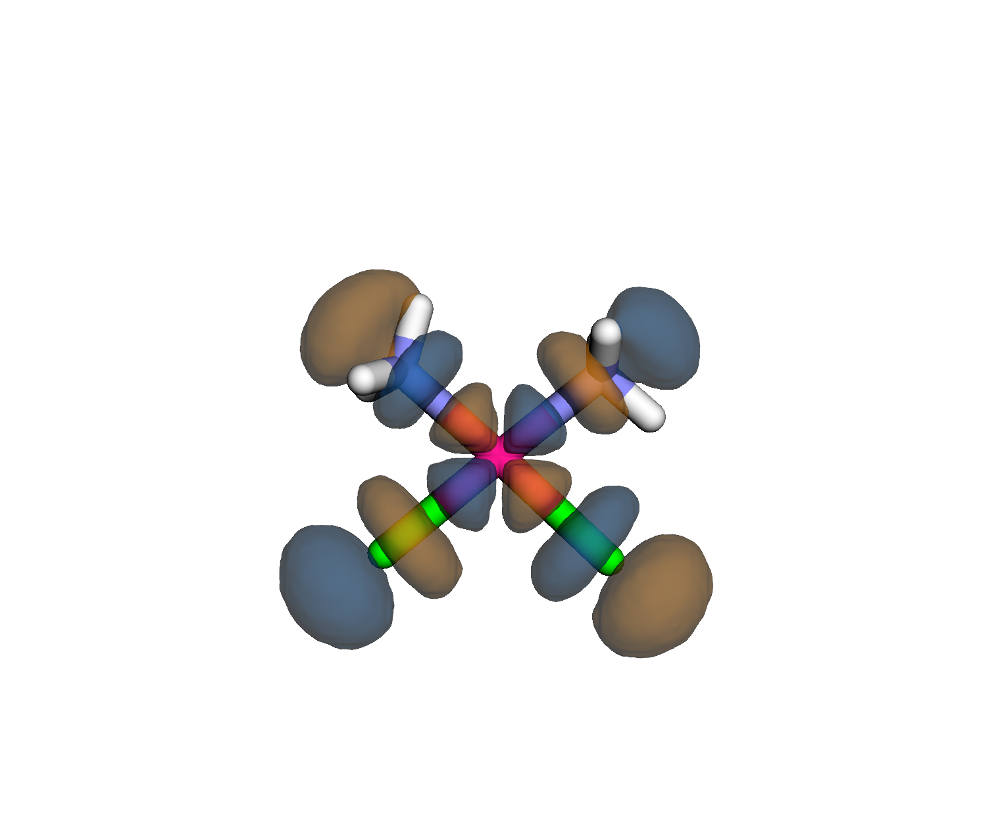
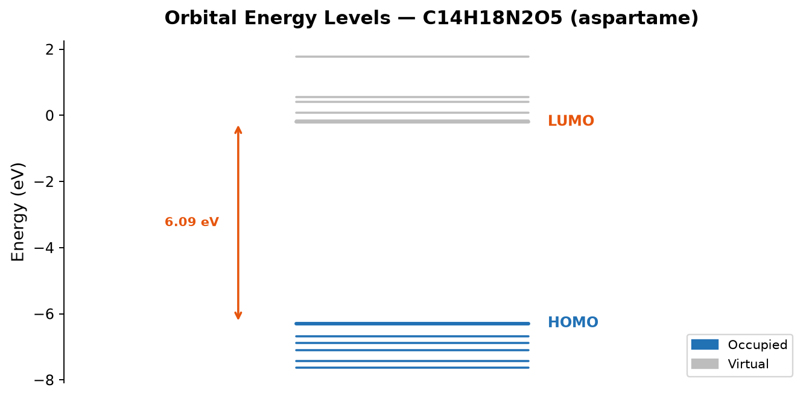
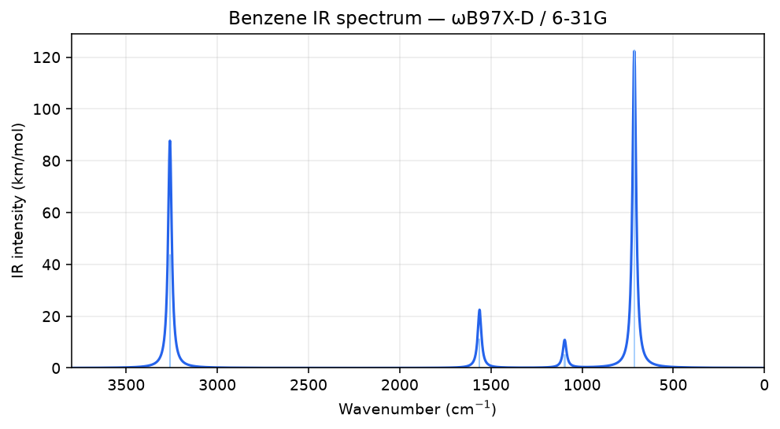
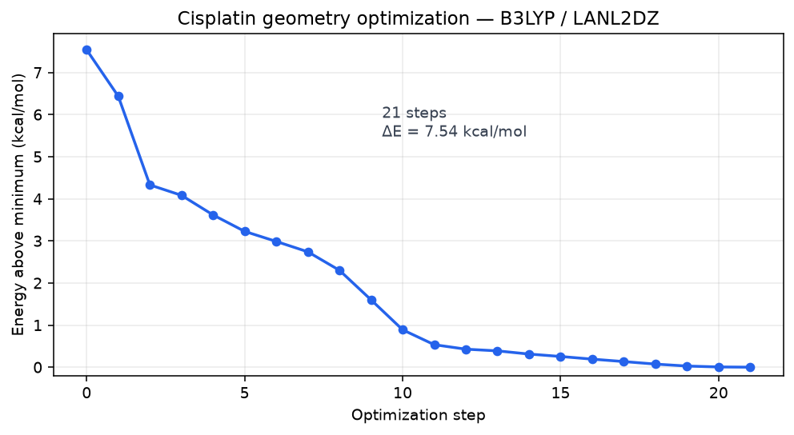

---
hide:
  - toc
  - title
---

<section class="hero quantui-bleed">
  

    

      

        

          <a class="pill" href="https://pypi.org/project/quantui/" target="_blank" rel="noopener">pip install quantui</a>
          Open-source PySCF frontend
          No cluster required
          Runs offline
          GPU-ready
        

        <h1 class="hero__title">Free, open, and interactive quantum chemistry</h1>
        

          QuantUI puts <a class="hero__link" href="https://pyscf.org" target="_blank" rel="noopener">PySCF</a>
          behind an interactive Jupyter/Voil&agrave; UI. Run DFT, MP2, CCSD,
          CCSD(T), TD-DFT, NMR, geometry optimization, frequencies, and
          PES scans &mdash; visualize structures, orbitals, IR and UV-Vis
          spectra, all on your laptop with optional NVIDIA GPU offload via
          <a class="hero__link" href="https://github.com/pyscf/gpu4pyscf" target="_blank" rel="noopener">gpu4pyscf</a>.
        

        

          <a class="btn btn--primary" href="https://github.com/The-Schultz-Lab/QuantUI">View on GitHub</a>
          <a class="btn btn--outline" href="installation/">Get started</a>
        

        

          Python 3.9&ndash;3.11
          &middot;
          1500+ tests
          &middot;
          MIT License
          &middot;
          Linux &middot; macOS &middot; WSL
        

      

      

        <svg class="atom-svg" viewBox="0 0 280 280" xmlns="http://www.w3.org/2000/svg">
          <defs>
            <filter id="glow" x="-50%" y="-50%" width="200%" height="200%">
              <feGaussianBlur stdDeviation="7" result="blur"/>
              <feMerge><feMergeNode in="blur"/><feMergeNode in="SourceGraphic"/></feMerge>
            </filter>
            <filter id="halo" x="-80%" y="-80%" width="260%" height="260%">
              <feGaussianBlur stdDeviation="22" result="blur"/>
              <feMerge><feMergeNode in="blur"/><feMergeNode in="SourceGraphic"/></feMerge>
            </filter>
          </defs>
          <circle cx="140" cy="140" r="48" fill="rgba(37,99,235,0.20)" filter="url(#halo)"/>
          <ellipse class="ring ring--1" cx="140" cy="140" rx="115" ry="33" stroke="#0891b2" stroke-width="1.4" fill="none" opacity="0.70"/>
          <ellipse class="ring ring--2" cx="140" cy="140" rx="115" ry="33" stroke="#0891b2" stroke-width="1.4" fill="none" opacity="0.55"/>
          <ellipse class="ring ring--3" cx="140" cy="140" rx="115" ry="33" stroke="#3b82f6" stroke-width="1.4" fill="none" opacity="0.42"/>
          <circle class="ring ring--1" cx="255" cy="140" r="5.5" fill="#67e8f9"/>
          <circle class="ring ring--2" cx="255" cy="140" r="4.5" fill="#93c5fd"/>
          <circle class="ring ring--3" cx="255" cy="140" r="4" fill="#60a5fa"/>
          <circle cx="140" cy="140" r="20" fill="rgba(37,99,235,0.25)" filter="url(#glow)"/>
          <circle cx="140" cy="140" r="14" fill="#2563eb" filter="url(#glow)"/>
          <circle cx="140" cy="140" r="8" fill="#60a5fa"/>
          <circle cx="137" cy="137" r="3" fill="rgba(255,255,255,0.45)"/>
        </svg>
      

    

  

</section>

<section class="section quantui-bleed" id="examples">
  

    <h2 class="section__title">See it in action</h2>
    

      Real QuantUI output &mdash; a molecular orbital, an orbital energy-level
      diagram, an IR spectrum, and a geometry optimization. The two panels marked
      <em>Interactive</em> are live: drag to rotate, press play.
    

    

      <figure class="gallery-figure">
        
        <figcaption>
          <strong>Cisplatin LUMO</strong>
          Molecular-orbital isosurface, B3LYP / LANL2DZ (ECP on Pt and Cl).
        </figcaption>
      </figure>
      <figure class="gallery-figure">
        
        <figcaption>
          <strong>Aspartame orbital energies</strong>
          Occupied/virtual energy levels, HOMO&ndash;LUMO gap 6.09 eV (B3LYP / 6-31G*).
        </figcaption>
      </figure>
      <figure class="gallery-figure">
        
        <figcaption>
          <strong>Benzene IR spectrum</strong>
          Analytical Hessian, &omega;B97X-D / 6-31G &mdash; the four IR-active bands.
        </figcaption>
      </figure>
      <figure class="gallery-figure">
        
        <figcaption>
          <strong>Geometry optimization</strong>
          Cisplatin relaxing over 21 BFGS steps, B3LYP / LANL2DZ.
        </figcaption>
      </figure>
      <figure class="gallery-figure">
        <iframe src="examples/cisplatin_trajectory.html" title="Cisplatin optimization trajectory (interactive)" loading="lazy"></iframe>
        <figcaption>
          Interactive
          <strong>Optimization trajectory</strong>
          Cisplatin relaxing step by step &mdash; press play, drag to rotate.
            <a href="examples/cisplatin_trajectory.html" target="_blank" rel="noopener">Open full &nearr;</a>
        </figcaption>
      </figure>
      <figure class="gallery-figure">
        <iframe src="examples/benzene_vib_mode.html" title="Benzene vibrational mode (interactive)" loading="lazy"></iframe>
        <figcaption>
          Interactive
          <strong>Vibrational mode</strong>
          A benzene normal mode animated in 3D.
            <a href="examples/benzene_vib_mode.html" target="_blank" rel="noopener">Open full &nearr;</a>
        </figcaption>
      </figure>
    

    

      <a class="btn btn--primary" href="gallery/">Full gallery &rarr;</a>
    

  

</section>

<section class="quickstart quantui-bleed">
  

    <h2 class="quickstart__title">Ready to run your first calculation?</h2>
    

      Install with conda or pip, then launch the notebook in JupyterLab or Voil&agrave;.
      Five step-by-step tutorials walk you through water, basis sets, radicals, ions, and comparisons.
    

    <a class="btn btn--primary" href="installation/">Installation guide &rarr;</a>
  

</section>

